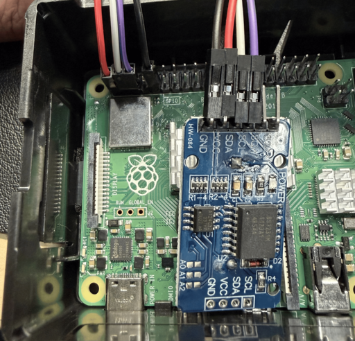

# server

Raspberry Pi 4 サーバーノード（FastAPI + SQLite）

## Prerequisites (電子回路)

| 電子部品 | 役割 | 接続先 | 備考 |
|---|---|---|---|
| Raspberry Pi 4 | サーバー（API・DB） | — | Python / FastAPI で動作 |
| DS3231（RTCモジュール） | 時刻管理 | I2C（SDA/SCL） | 停電時も時刻を保持 |
| ジャンプワイヤー | 電源供給 | 3.3V ピン → DS3231 VCC | — |
| ジャンプワイヤー | GND | GND ピン → DS3231 GND | — |

### 回路イメージ



## セットアップ

```sh
uv sync
```

## 起動

```sh
uv run uvicorn server.main:app --host 0.0.0.0 --port 8000
```

## API エンドポイント

| メソッド | パス | 用途 |
|--------|------|------|
| `POST` | `/data` | センサーデータ受信・DB保存 |
| `POST` | `/heartbeat` | ハートビート受信（DB保存なし） |
| `GET` | `/latest` | 全ノードの最新データ（ライブテレメトリ） |
| `GET` | `/time` | Pi 4 の現在時刻（RTC由来）を Pico 2W に提供 |
| `GET` | `/health` | サーバー死活確認 |
| `GET` | `/nodes` | 登録済みノード一覧 |
| `GET` | `/dates/{node_id}` | ノードのデータ取得可能日付一覧 |
| `GET` | `/data/{node_id}/{date}` | 指定日のセンサーデータ取得（`YYYY-MM-DD`） |
